The following documentation explains how to use the beta version of the RADON integrated framework by means of the RADON IDE.

Access to the RADON IDE  
"""""""""""""""""""""""

Use the following `form <https://mailchi.mp/fe5357445dba/radon-ide-access-request/>`_ to request access to the RADON IDE. An account will be created and the credentials will be sent via the email specified in the form.

After receiving the credentials, login to the RADON IDE (Figure 1) connecting to the `Che Login page <http://che-che.217.172.12.178.nip.io>`_ to access the main Che dashboard (Figure 2). In the *Workspaces tab* the list of already created workspaces is visible and it is possible to create new ones. 

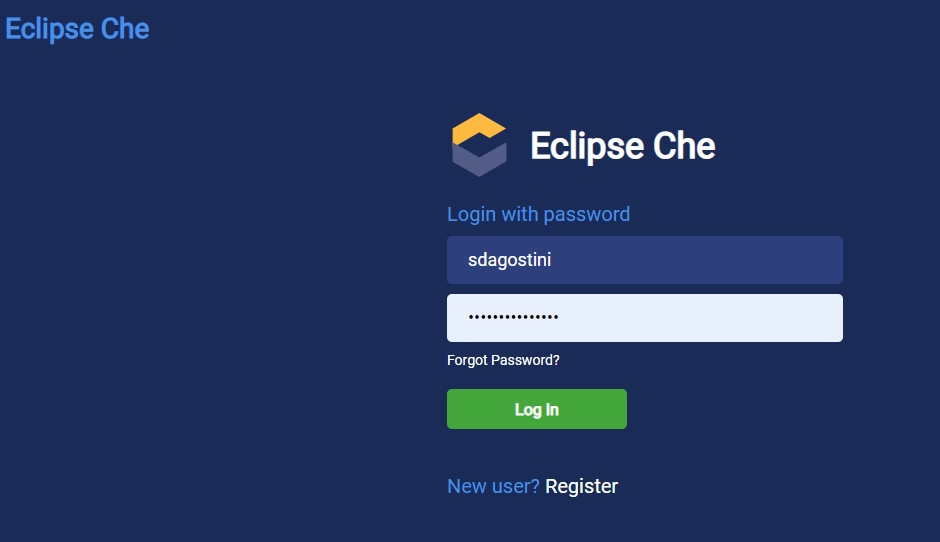

   Figure 1: RADON IDE Login.

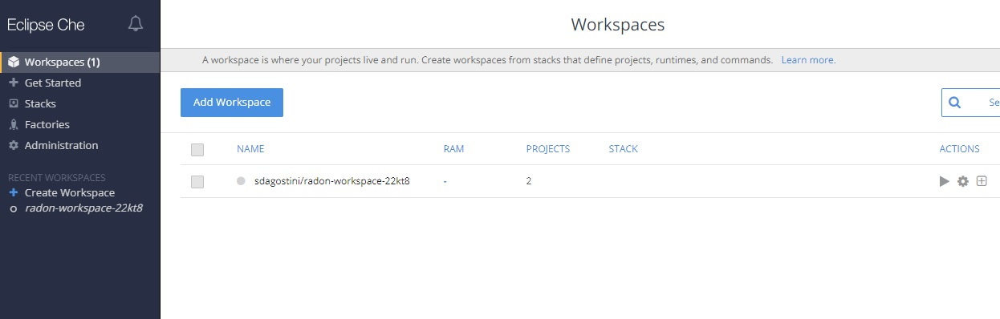

   Figure 2: IDE Dashboard.

Create a RADON workspace
""""""""""""""""""""""""
In the Eclipse Che dashboard select *Get Started* tab and then *Custom Workspace*. Copy the URL of the *RADON Devfile* available `here <https://raw.githubusercontent.com/radon-h2020/radon-ide/master/devfiles/radon/v0.0.3/devfile.yaml>`_ and paste it in the field *URL of devfile*
under *Devfile* section. Then click on *Load devfile* and once the RADON devfile has been loaded click on the *Create & Open* button (Figure 3).

.. figure:: imgs/LoadRADONDevfile.jpg

   Figure 3: Create a RADON Workspace.

As depicted in Figure 4, a RADON workspace is started. It provides the “radon-particles” modeling project with a directory structure compliant with the GMT and the set of integrated RADON tools enabled (i.e., GMT, VT, DT, DPT, CTT, Delivery Toolchain).

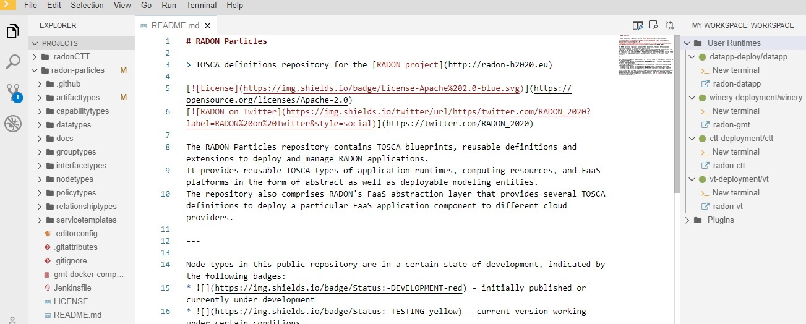

   Figure 4: RADON Workspace.

How to launch RADON tools 
"""""""""""""""""""""""""

Graphical Modeling Tool
***********************
The GMT can be used within the RADON IDE to model an application. To launch the GMT, click on the *radon-gmt* option, present on the *My Workspace* right panel, as depicted in Figure 5.

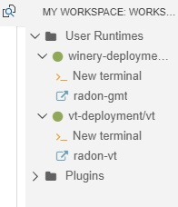

   Figure 5: How to launch GMT.

The browser window of the GMT will be opened (Figure 6) to create or adapt existing TOSCA modeling entities as well as to compose new applications interacting with files and folders from the "modeling project" inside the workspace.

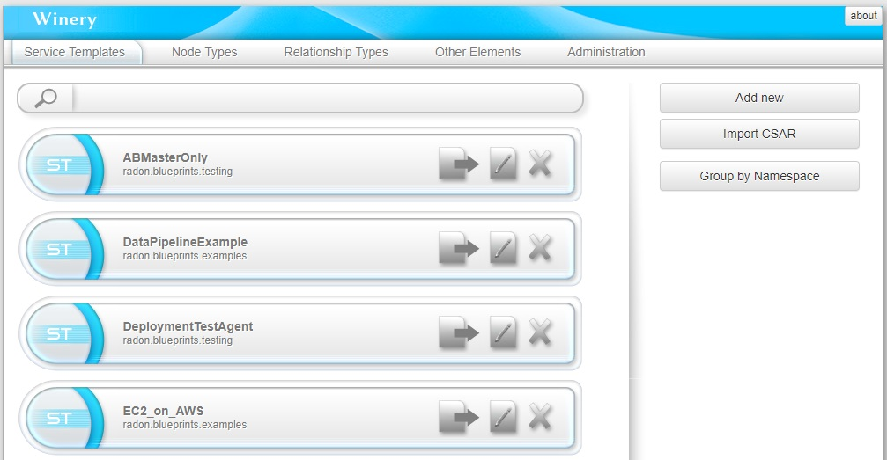

   Figure 6: GMT Dashboard: List of available RADON Models.

GMT is a web-based environment to graphically model TOSCA topologies.
Follow the official `user guide <https://winery.readthedocs.io/en/latest/user/index.html>`_ to learn how to use the tool.

One important aspect is the *Export to Filesystem* functionality (Figure 7).
It permits to package and save a CSAR of a selected RADON Model to the workspace to process it using other RADON tools or to deploy it using the Orchestrator.
The RADON model will be exported in a CSAR file and will be store in the *radon-csar* folder (Figure 8).

.. figure:: imgs/GMT_Export.jpg

   Figure 7: Export CSAR.
   
.. figure:: imgs/GMT_csar_light.jpg

   Figure 8: *radon-csar* folder.

Verification Tool
*****************

The Verification Tool is used within the RADON IDE to verify that a RADON model conforms to the CDL specifications. The .cdl files defining the CDL specifications for a specific RADON model can be edited, imported and updated within the workspace of IDE (Figure 9). To get started, you can clone the `verification tool sample project <https://github.com/radon-h2020/demo-verification-tool-sample-project.git>`_ in the workspace, which contains a sample TOSCA model and a CDL specification. To clone this project use the Git functionalities provided in the workspace as described below:

1. Press *Ctlt+Shift+P* to open the command palette. Select the *Git:Clone* command and type the Repository URL of the verification tool sample project. 
2. Press *Enter* to clone the project in the workspace

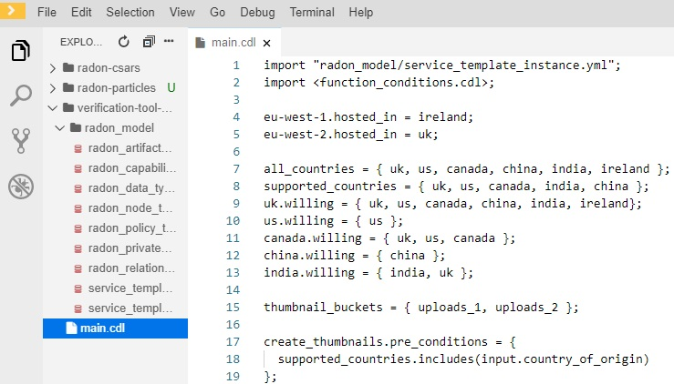

   Figure 9: Edit CDL specifications.

To verify that the RADON model conforms to these CDL specifications, make a right-click on the .cdl file and select the *Verify* option (Figure 10). The verification results are shown in the *RADON Verification Tool* output panel (Figure 11).
 
.. figure:: imgs/VT_verify_light.jpg

   Figure 10: Verification of CDL specifications by means of the VT.

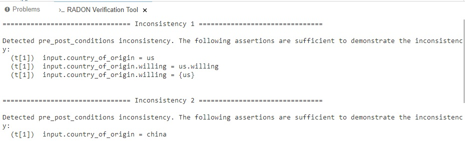

   Figure 11: RADON Verification Tool output panel.

In addition to the verification mode of the tool, the VT also allows users to search for corrections to a RADON model and to learn additional constraints in a CDL specification. These two modes can be launched in a similar way, by selecting the *Correct* or *Learn* option after right-clicking on a .cdl file.

Decomposition Tool
******************
The Decomposition Tool is used within the RADON IDE to optimize the deployment of a RADON model. To get started, you can clone the `decomposition tool sample project <https://github.com/radon-h2020/demo-decomposition-tool-sample-project.git>`_ in the workspace, which contains a *demo-app* project. To clone this project use the Git functionalities provided in the workspace as described below:

1. Press *Ctlt+Shift+P* to open the command palette. Select the *Git:Clone* command and type the Repository URL of the decomposition tool sample project. 
2. Press *Enter* to clone the project in the workspace

To invoke the optimize functionality of the DT, make a right-click on the service template (.yaml) and select the Optimize option (Figure 12). The service template will be updated according to the optimal deployment scheme, and the minimum operating cost will be printed in the Output window (View → Output) as depicted in Figure 13.
   
.. figure:: imgs/DT_optimize_light_2.jpg

   Figure 12: Optimize deployment by means of DT.
   
.. figure:: imgs/DT_output_light_2.jpg

   Figure 13: Decomposition Tool output window.

Defect Prediction Tool
**********************
The Defect Prediction Tool is used within the RADON IDE to check defects in Ansible and Tosca IaC scripts. 
To invoke the detection functionality of the DPT, make a right-click on a YAML-based Ansible file (i.e. .yaml file) or a CSAR folder (i.e., .csar file). 
Alternatively, you can run the detection from a single Ansible playbook from the active editor with the open YAML file and select the Run Detection option (Figure 14).
The results (i.e., the metrics extracted from the script and defect-proneness) will be displayed in a new active tab (Figure 15).

.. figure:: imgs/DPT_detection_light.jpg

   Figure 14: Check defects on an Ansible playbook by means of DPT
   
.. figure:: imgs/DPT_output_light.jpg

   Figure 15: Defect Prediction Tool output window.

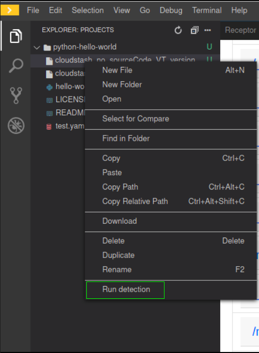
   
   Figure 16: Check defects in a Cloud Service Archive by means of DPT

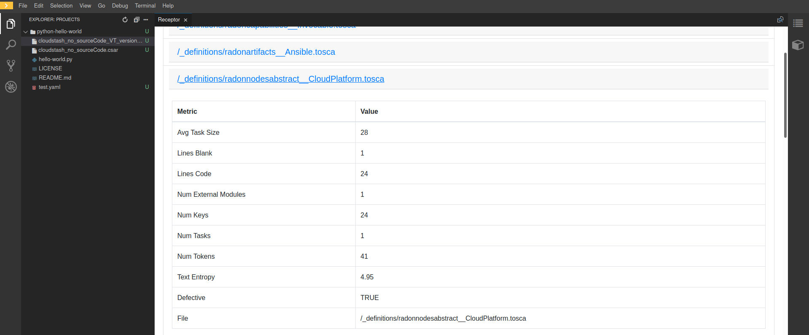

   Figure 17: Defect Prediction Tool output window for CSAR files.

Continuous Testing Tool 
***********************

The Continuous Testing Tool (CTT) is used within the RADON IDE to define and execute tests, which are specified in a CSAR for a system under test (SUT). To get started, you can clone the `CTT sample project <https://github.com/radon-h2020/demo-ctt-imageresize>`_. To clone this project use the Git functionalities provided in the workspace as described below:

1. Press *Ctlt+Shift+P* to open the command palette. Select the *Git:Clone* command and type the above repository URL of the CTT sample project. 
2. Press *Enter* to clone the project in the workspace

In the folder *radon-ctt/*, you will find sample CSAR files for the SUT and the test infrastructure (TI). These files are exports from the service templates that can also be found in the RADON Particles. Hence, for using other SUT and TI CSAR files, users will need to export them via GMT. 

To create a CTT configuration for an SUT CSAR file, make a right-click on the file, e.g., *sut-ec2.csar*, and select "Create test configuration" (Figure 18).

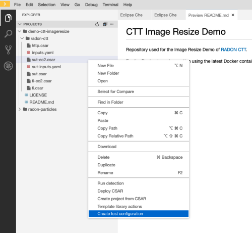

   Figure 18: Creating a configuration file template for a CSAR.

You fill find a new configuration file next to the CSAR file, e.g., *sut-ec2_testconfig.yml*. Double-click on the configuration file and it will be shown in the editor. Once the configuration file has been completed, the execution can by triggered by a right-click on the file and selecting "Execute test configuration" (Figure 19). 

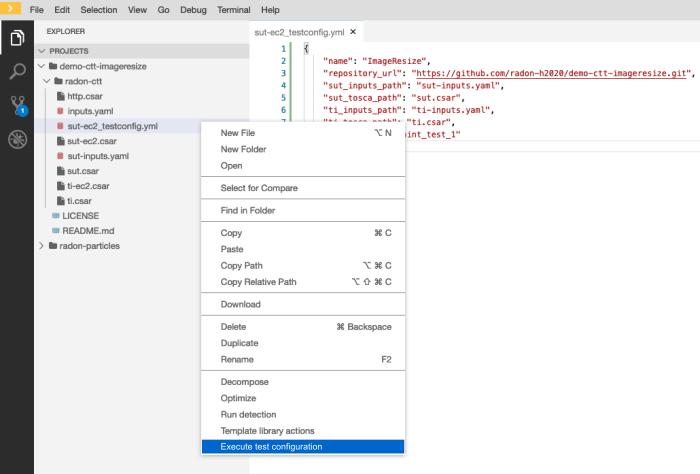

   Figure 19: Executing CTT based on a configuration file.

CTT will now execute all steps of the CTT workflow, including the deployment of the SUT and the CSAR, as well as executing the tests and fetching the results. After a successful execution, the results are stored in the configured folder (Figure 20).

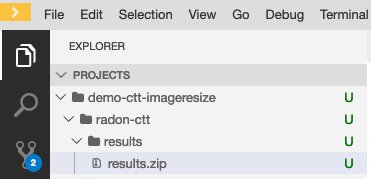

   Figure 20: Results of the test execution.

Template library
****************
The Template library RADON IDE plugin is used for communication between Template library and the RADON IDE (Eclipse Che). Using the plugin, the user is able to
manage, store and retrieve his TOSCA modules (templates, blueprints (CSARs)) and their implementations (e.g. Ansible playbooks) from Eclipse Che Theia or Visual Studio Code.

To prevent any possible confusions remember that Template library (service) or its parts may also be called TPS (Template Publishing Service) or
TLPS (Template Library Publishing Service). If you are totally unfamiliar with TPS you can take a look at the
[Template library's documentation](https://template-library-radon.xlab.si/docs/).

Main features
=============
The extension uses the [Template library REST API](https://template-library-radon.xlab.si/swagger/) and can therefore invoke various Template library actions.

Currently, supported actions are:

- setting Template library REST API endpoint
- creating and publishing TOSCA template or CSAR and its version
- downloading a specific template version files
- deleting saved login info (KeyCloak cookies)

Usage
======
The plugin is invoked by right clicking on the file from file explorer or in the editor. There are four
commands that can be selected from the dropdown options and these are further explained within the next sections.

.. figure:: imgs/tl/commands.png

   Figure 21: Template library plugin commands

Template library authentication
-------------------------------
When right clicking on any Template library plugin command (except from set API endpoint and clean login info commands),
the extension will verify user's credentials if the data has been saved. So, the first time when user wants to use
the plugin, he will be offered a set of options to select the prefferd authentication method for the Template library.
Since Template library auth works through KeyCloak, there can be multiple login methods. You can login with:

- XLAB KeyCloak native credentials (available at https://openid-radon.xlab.si/auth/realms/master/account)
- RADON and other identity providers that are connected to the XLAB KeyCloak
- Native Template library credentials (a new user can be created by following these instructions: https://template-library-radon.xlab.si/)

.. figure:: imgs/tl/auth_methods.png

   Figure 22: Template library plugin auth

If the login does not succeed, you will be warned and will have to login again. If the login succeeds, the KeyCloak auth cookies
will be stored into the local storage and next time you invoke the any plugin command, you won't have to login again. But if you
for instance set Template library API endpoint to something else or if you wish to login as another KeyCLoak user, the it is wise
to clear saved login data by invoking the "Delete login info" action. If you log in as a native user, no data will be saved and
you will have to login again every time you use the plugin.

.. figure:: imgs/tl/login_password.png

   Figure 23: Password prompt

.. figure:: imgs/tl/login_success.png

   Figure 24: Login success

Template library set REST API endpoint
--------------------------------------
This command is used to set TPS REST API endpoint that will be used for executing the TPS HTTP requests. The
default value here is `https://template-library-radon.xlab.si/api` which is pointing to the public TPS REST API URL.
This command was meant mostly for testing different versions of TPS API so currently there is no need to change it.

.. figure:: imgs/tl/set_api_endpoint.png

   Figure 25: Set TPS REST API endpoint

Template library config actions
-------------------------------
If you choose this option the TPS actions can be invoked via JSON config file. If you right clicked on the JSON
file (from the editor or from the file explorer) you will be offered to chose it as a config file. If not, you will
be asked to select this configuration file from other folders.

JSON object that is present in the config file should follow an exact structure with which depends on the type of the action.
The JSON keys specified are not mutually exclusive so you can execute multiple TPS actions with one JSON config file.

Create template JSON config
~~~~~~~~~~~~~~~~~~~~~~~~~~~
JSON object for creating a template must have all these keys:

+---------------------------------+-----------------------------------------------------------------+
| JSON key                        | Description                                                     |
+=================================+=================================================================+
| **upload_template_name**        | Template name you want to create                                |
+---------------------------------+-----------------------------------------------------------------+
| **upload_template_description** | Template description                                            |
+---------------------------------+-----------------------------------------------------------------+
| **upload_template_type_name**   | Template type name (e.g. node, relationship, csar,...)          |
+---------------------------------+-----------------------------------------------------------------+
| **upload_public_access**        | Make template publicly visible for other TPS users (true/false) |
+---------------------------------+-----------------------------------------------------------------+

Example:

.. code-block:: json
    {
        "upload_template_name": "aws_bucket",
        "upload_template_description": "AWS bucket node",
        "upload_template_type_name": "node",
        "upload_public_access": "true"
    }

.. figure:: imgs/tl/upload_config.png

   Figure 26: Upload config action

Upload template version JSON config
~~~~~~~~~~~~~~~~~~~~~~~~~~~~~~~~~~~
When uploading a template version you can use the following keys (`upload_readme_file` and `upload_implementation_files` are optional).

+---------------------------------+--------------------------------------------------------------------------------------+
| JSON key                        | Description                                                                          |
+=================================+======================================================================================+
| **upload_version_name**         | Semantic version name                                                                |
+---------------------------------+--------------------------------------------------------------------------------------+
| **upload_readme_file**          | Optional path to README file to upload                                               |
+---------------------------------+--------------------------------------------------------------------------------------+
| **upload_template_file**        | TOSCA YAML service template file or compressed TOSCA Cloud Service Archive (CSAR)    |
+---------------------------------+--------------------------------------------------------------------------------------+
| **upload_implementation_files** | Optional JSON array of paths to TOSCA model implementation files (Ansible playbooks) |
+---------------------------------+--------------------------------------------------------------------------------------+

Example:

.. code-block:: json
    {
        "upload_version_name": "2.1.5",
        "upload_readme_file": "./aws_bucket/README.md",
        "upload_template_file": "./aws_bucket/service_template.yaml",
        "upload_implementation_files": [
            "./aws_bucket/playbooks/create.yaml",
            "./aws_bucket/playbooks/delete.yaml"
        ]
    }

.. figure:: imgs/tl/upload_success.png

   Figure 27: Successful template version upload

Download template version JSON config
~~~~~~~~~~~~~~~~~~~~~~~~~~~~~~~~~~~~~
When downloading template version files you will get all version files (TOSCA template and playbooks) compressed in a zip
file (if you provided just a CSAR without implementation files, you will get back this CSAR).

+----------------------------+------------------------------------------------------+
| JSON key                   | Description                                          |
+============================+======================================================+
| **download_template_name** | Name of the template you want to download            |
+----------------------------+------------------------------------------------------+
| **download_version_name**  | Semantic template version you want to get files from |
+----------------------------+------------------------------------------------------+
| **download_path**          | Path where downloaded file will be stored            |
+----------------------------+------------------------------------------------------+

Example:

.. code-block:: json
    {
        "download_template_name": "aws_bucket",
        "download_version_name": "2.1.5",
        "download_path": "./AwsBucket.zip"
    }

.. figure:: imgs/tl/download_config.png

   Figure 28: Download config action

.. figure:: imgs/tl/download_success.png

   Figure 29: Successful template version download

Template library interactive actions
------------------------------------
This TPS RADON IDE extension command will guide you through an interactive Eclipse Theia tasks, where you will be able
to create templates, upload template versions or download version files from Template library service. More images
from the plugin are can be found here: `https://github.com/radon-h2020/radon-template-library-publishing-service-plugin <https://github.com/radon-h2020/radon-template-library-publishing-service-plugin>`_.

Template library delete login info
----------------------------------
This Template library plugin command will make sure that the saved login data gets deleted (e.g. KeyCloak cookies). After
that you will have to login again if you activate any TPS commands.

xOpera SaaS
***********

The xOpera SaaS orchestrator is used to deploy the application blueprint (CSAR)
within the RADON IDE. Initially, the TOSCA opera orchestrator was available
only as a CLI tool (it can be be downloaded from the Python Package Index:
https://pypi.org/project/opera/)

The SaaS orchestrator has been developed with the integration in mind and
includes the API allowing managing all orchestrator functions and the
integration with KeyCloak identity manager that allows easy integration with
other identity management services.

Apart from Identity Manager (KeyCloak) and a web GUI, the orchestrator has also
Che and Visual Studio Code plugin that provides the ability to create and run
deployment projects created inside the SaaS orchestrator.

There are currently two commands that can be invoked from the explorer Eclipse
Che Theia/Visual Studio Code context. These are:

- "xOpera SaaS: Create project from CSAR"
- "xOpera SaaS: Delete login info"

The authentication to the SaaS component is performed in the similar way as
this is done for the Template library. This means that when using the SaaS
plugin the first time, the user will be prompted to select his preferred way
of logging in. This can be either through an XLAB KeyCloak instance or through
any of the connected identity providers (like RADON IDE KeyCloak). After that
the login data will be saved and the user will be able to invoke the plugin
commands (if the user would want to remove his saved login data he could click
on the "xOpera SaaS: Delete login info" option).

The main command is "xOpera SaaS: Create project from CSAR". By invoking this,
the plugin currently allows users to:

- create a new workspace
- create a new project in a new or existing workspace
- deploy a project

The functions through the plugin are a bit limited, as it is more convenient
than other actions are performed through the Opera SaaS web interface.

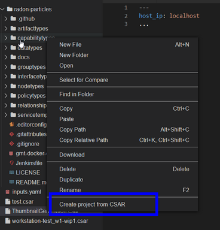

   Figure 30: Deployment of the CSAR.

User can invoke the main plugin actions by right clicking on the compressed
TOSCA CSAR (file should include .zip or .csar extension). Then the plugin will
interactively guide him through the creation of workspace and the project.

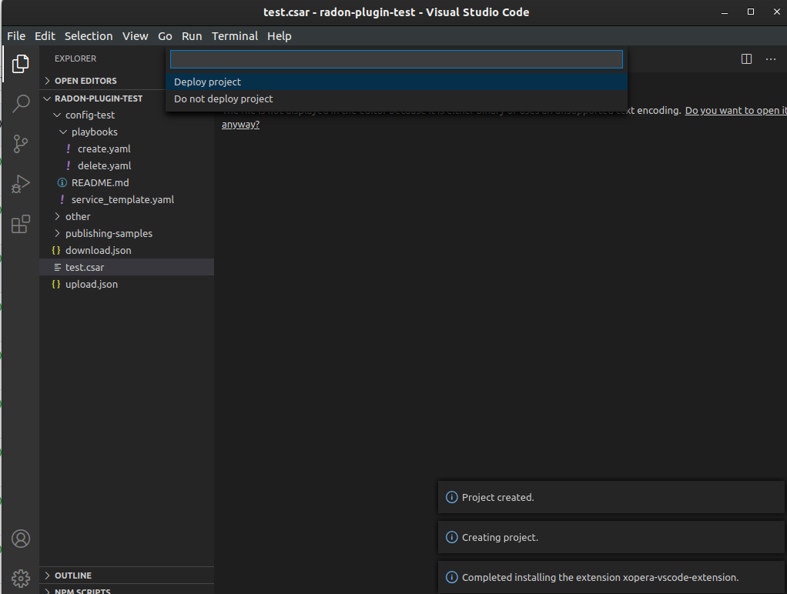

   Figure 31: Creating a new project.

After that you will be asked if you want to deploy the CSAR from the project.
The deployment process starts right away and gives you the deployment outputs
from the xOpera SaaS orchestrator. Then the plugin will then redirect you to
the SaaS UI where you will be able to see your created workspace and project.

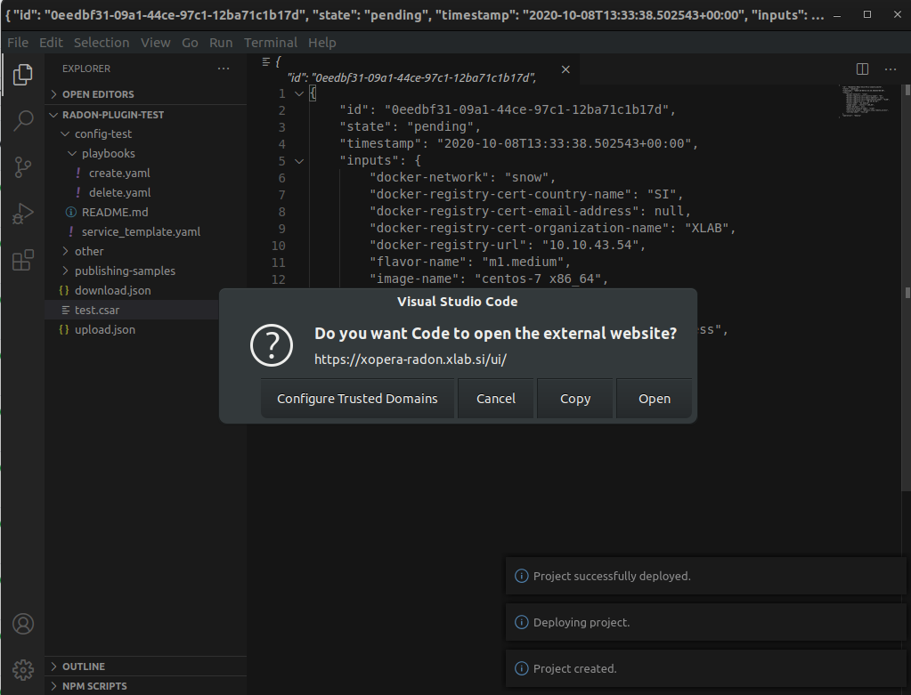

   Figure 32: The xOpera SaaS plugin redirection.

Trigger CI
""""""""""""""""""""""

**CI/CD preconditions**

* A configured Jenkins server
* A user with execution access to jobs
* A configured Jenkins job

Setup guides can be found in `CI/CD templates <https://github.com/radon-h2020/radon-cicd-templates>`_. Here you can configure your own pipeline in the Jenkinsfile format. All tools have its corresponding folder where examples are listed. You as a user are free to cherrypick the code snippets in order to generate the ideal Jenkinsfile. Figure beneath depicts a configuration where a CSAR is fetched from Template Library and deployed to AWS cloud.

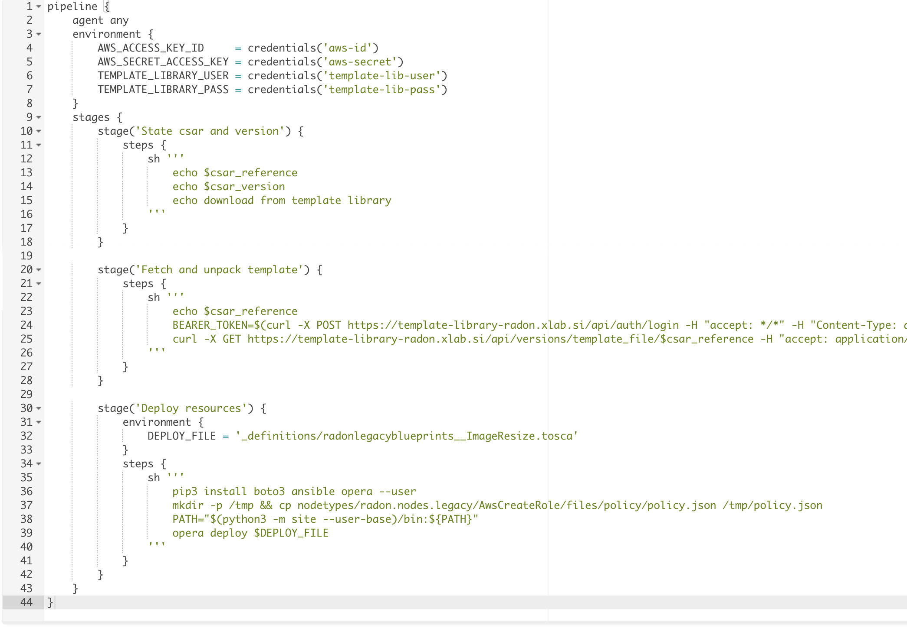

**CI/CD execution**

The user can trigger CI functionality through the IDE. The use of CI jobs provides more flexability, for instance it is possible to include different tollgates in the  deployment process (i.e. the job pipelines can be complex as you want).
To trigger the CI process, select the CSAR, stored in the radon-csar project, make a right-click on it and select the *Trigger CI* option as depicted in Figure 33.

.. figure:: imgs/TriggerCI.jpg

   Figure 33: Trigger CI.

During the CI process, the system asks the user if the selected CSAR has been already uploaded on the Template Library (Figure 34).

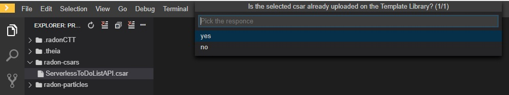

   Figure 34: Check if the CSAR has been upload on the Template Library.

If the CSAR is already uploaded, the system asks the user to insert the name of the CSAR to deploy via a Jenkins job after having performed the login with the Template Library (Figure 35). It is possible to specify part of the CSAR name to get the list of available CSARs uploaded on the Template Library.

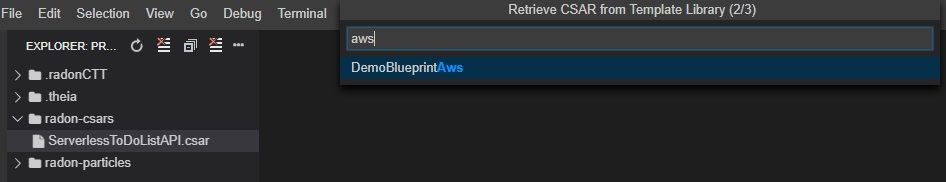

   Figure 35: Select CSAR from Template Library

Once selected the CSAR, the system asks the user to select one of the available versions of the CSAR (Figure 36). 

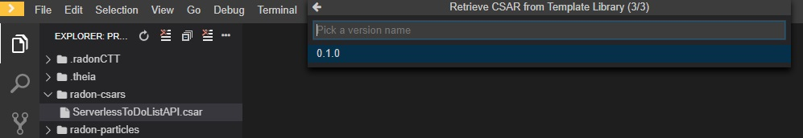

   Figure 36: Select CSAR version from Template Library

Once selected the CSAR version, the system asks the user to specify a set of Jenkins configurations to trigger the CI job. In particular, the user has to specify:

- the URL of the Jenkins instance to use (Figure 37);
- the Jenkins user credentials, i.e. username and password, (Figure 38 and Figure 39);
- the Jenkins job to trigger (Figure 40);
- the token to run the job (Figure 41).

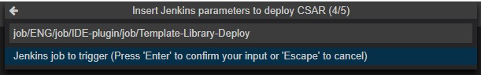

   Figure 37: Insert Jenkins URL

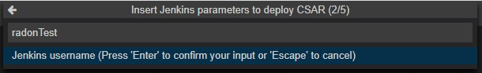

   Figure 38: Insert Jenkins credential: username

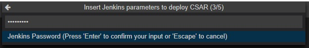

   Figure 39: Insert Jenkins credential: password

   Figure 40: Insert Jenkins job to trigger 

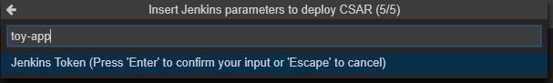

   Figure 41: Insert Jenkins job's token

Finally, the specified Jenkins job is triggered to manage the deployment of the CSAR with the Orchestrator.

If the selected CSAR was not uploaded yet on the Template Library, the system guides the user to create a new whole CSAR template or a new version for the CSAR (Figure 42). The created new template (or new version) is then uploaded on the Template Library and, as mention above, the system asks the user to insert the Jenkins configurations to trigger the CI job. 

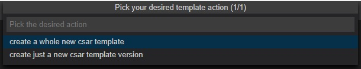

   Figure 42: Create a new CSAR Template or new CSAR version

Other RADON Commands
""""""""""""""""""""
From the command palette of the IDE (shown with *Ctrl+Shift+P*), a RADON menu (Figure 43) is available to perform the following actions:

- Visualize the status of the CI process by selecting the *Show CI Status* option. Once this command is selected, a browser window connecting to a page showing the status of the Jenkins CI job will be opened;
- Open the RADON Help Page by selecting the *Open Help Page* option. Once this command is selected a browser window connecting to the RADON methodology GitHub page will be opened;
- Open the RADON Monitoring Page by selecting the *Open Monitoring Page* option. Once this command is selected a browser window connecting to the RADON Monitoring Dashboard will be opened.

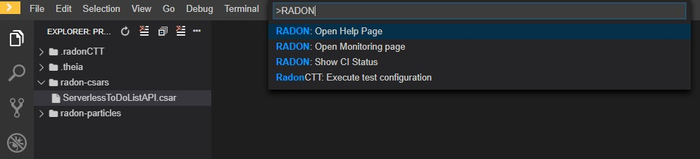

   Figure 43: RADON menu in the command palette.
