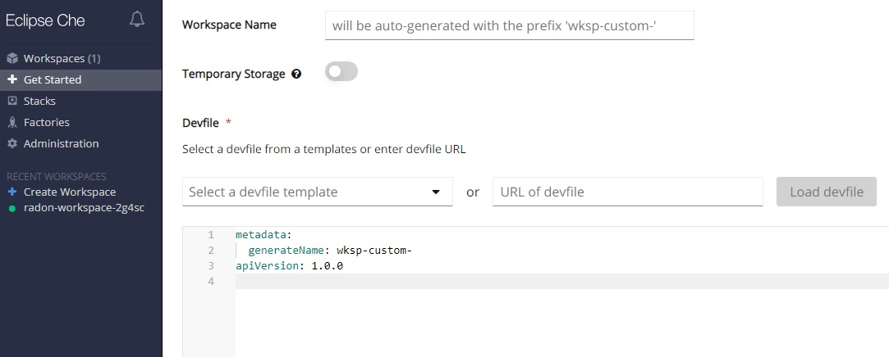
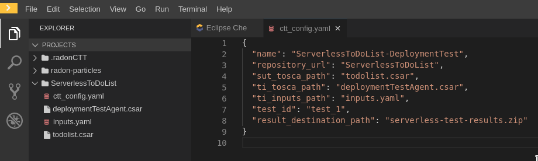
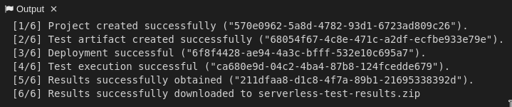
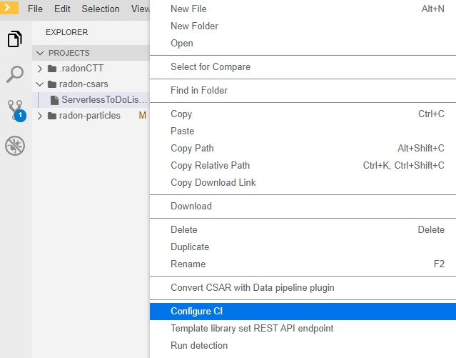
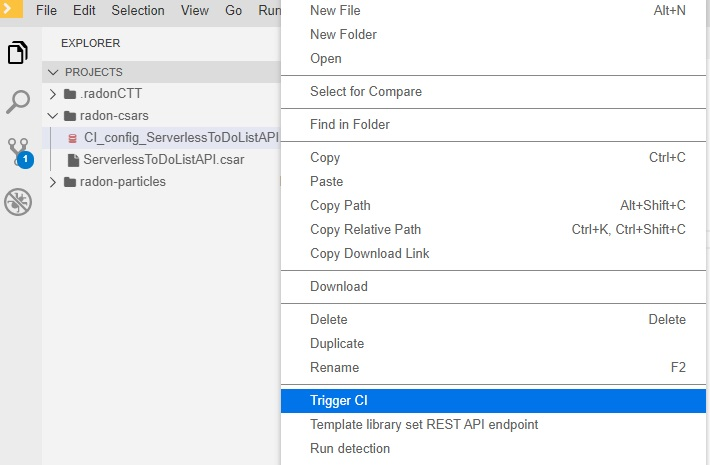
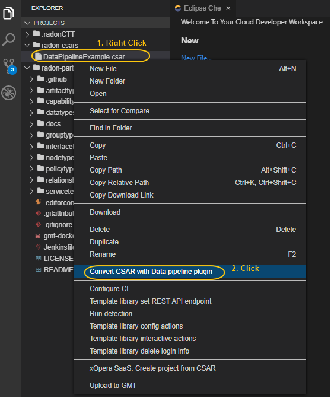
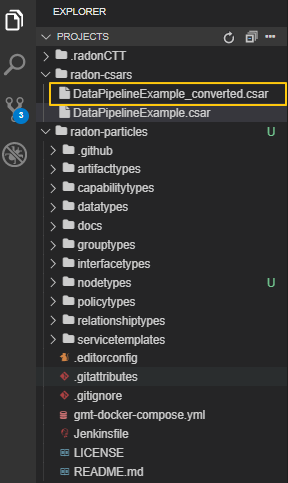
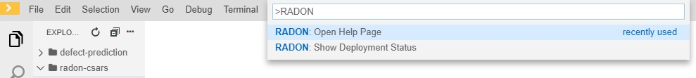

The following documentation explains how to use the final release of the RADON integrated framework by means of the RADON IDE.

Access to the RADON IDE  
"""""""""""""""""""""""

Use the following `form <https://mailchi.mp/fe5357445dba/radon-ide-access-request/>`_ to request access to the RADON IDE. An account will be created and the credentials will be sent via the email specified in the form, along with the URL to the RADON Stack devfile.

After receiving the credentials, login to the RADON IDE (Figure 1) connecting to the `Che Login page <http://che-che.217.172.12.178.nip.io>`_ to access the main Che dashboard (Figure 2). In the *Workspaces tab* the list of already created workspaces is visible and it is possible to create new ones. 

.. figure:: imgs/IDE_Login.jpg

   Figure 1: RADON IDE Login.

.. figure:: imgs/EclipseCheDashboard_2.jpg

   Figure 2: IDE Dashboard.

Create a RADON workspace
""""""""""""""""""""""""
In the Eclipse Che dashboard select *Get Started* tab and then *Custom Workspace*. Copy the URL of the *RADON Devfile* received by email and paste it in the field *URL of devfile*
under *Devfile* section. Then click on *Load devfile* and once the RADON devfile has been loaded click on the *Create & Open* button (Figure 3).

   Figure 3: Create a RADON Workspace.

As depicted in Figure 4, a RADON workspace is started. It provides the “radon-particles” modeling project with a directory structure compliant with the GMT and the set of integrated RADON tools enabled (i.e., GMT, VT, DT, DPT, CTT, TL, Delivery Toolchain).

.. figure:: imgs/IDE_RADONWorkspace_Light.jpg

   Figure 4: RADON Workspace.

How to launch RADON tools 
"""""""""""""""""""""""""

Graphical Modeling Tool
***********************
The GMT can be used within the RADON IDE to model an application. To launch the GMT, click on the *radon-gmt* option, present on the *My Workspace* right panel, as depicted in Figure 5.

.. figure:: imgs/LaunchGMT_Light.jpg

   Figure 5: How to launch GMT.

The browser window of the GMT will be opened (Figure 6) to create or adapt existing TOSCA modeling entities as well as to compose new applications interacting with files and folders from the "modeling project" inside the workspace.

.. figure:: imgs/GMT.jpg

   Figure 6: GMT Dashboard: List of available RADON Models.

GMT is a web-based environment to graphically model TOSCA topologies.
Follow the official `user guide <https://winery.readthedocs.io/en/latest/user/index.html>`_ to learn how to use the tool.

One important aspect is the *Export to Filesystem* functionality (Figure 7).
It permits to package and save a CSAR of a selected RADON Model to the workspace to process it using other RADON tools or to deploy it using the Orchestrator.
The RADON model will be exported in a CSAR file and will be store in the *radon-csar* folder (Figure 8).

.. figure:: imgs/GMT_Export.jpg

   Figure 7: Export CSAR.
   
.. figure:: imgs/GMT_csar_light.jpg

   Figure 8: *radon-csar* folder.

Verification Tool
*****************

The Verification Tool is used within the RADON IDE to verify that a RADON model conforms to the CDL specifications. The .cdl files defining the CDL specifications for a specific RADON model can be edited, imported and updated within the workspace of IDE (Figure 9). To get started, you can clone the `verification tool sample project <https://github.com/radon-h2020/demo-verification-tool-sample-project.git>`_ in the workspace, which contains a sample TOSCA model and a CDL specification. To clone this project use the Git functionalities provided in the workspace as described below:

1. Press *Ctrl+Shift+P* to open the command palette. Select the *Git:Clone* command and type the Repository URL of the verification tool sample project. 
2. Press *Enter* to clone the project in the workspace

.. figure:: imgs/VT_cdl_light.jpg

   Figure 9: Edit CDL specifications.

To verify that the RADON model conforms to these CDL specifications, make a right-click on the .cdl file and select the *Verify* option (Figure 10). The verification results are shown in the *RADON Verification Tool* output panel (Figure 11).
 
.. figure:: imgs/VT_verify_light.jpg

   Figure 10: Verification of CDL specifications by means of the VT.

.. figure:: imgs/VT_output_light.jpg

   Figure 11: RADON Verification Tool output panel.

In addition to the verification mode of the tool, the VT also allows users to search for corrections to a RADON model and to learn additional constraints in a CDL specification. These two modes can be launched in a similar way, by selecting the *Correct* or *Learn* option after right-clicking on a .cdl file.

Decomposition Tool
******************
The Decomposition Tool is used within the RADON IDE to optimize the deployment of a RADON model. To get started, you can clone the `decomposition tool sample project <https://github.com/radon-h2020/demo-decomposition-tool-sample-project.git>`_ in the workspace, which contains a *demo-app* project. To clone this project use the Git functionalities provided in the workspace as described below:

1. Press *Ctlt+Shift+P* to open the command palette. Select the *Git:Clone* command and type the Repository URL of the decomposition tool sample project. 
2. Press *Enter* to clone the project in the workspace

To invoke the optimize functionality of the DT, make a right-click on the service template (.yaml) and select the Optimize option (Figure 12). The service template will be updated according to the optimal deployment scheme, and the minimum operating cost will be printed in the Output window (View → Output) as depicted in Figure 13.
   
.. figure:: imgs/DT_optimize_light_2.jpg

   Figure 12: Optimize deployment by means of DT.
   
.. figure:: imgs/DT_output_light_2.jpg

   Figure 13: Decomposition Tool output window.

Defect Prediction Tool
**********************

The Defect Prediction Tool is used within the RADON IDE to enable operators to identify potentially defective IaC blueprints in Ansible or Tosca, and their defect type. 
It consists of a Visual Studio Code extension integrated into an Eclipse Che environment, and provides a graphical user interface to run the detection on a given Ansible or Tosca blueprint and display the results. 
The extension is packaged as an Eclipse Che Theia plugin into a sidebar container. 
An operator can interact with it and invoke the detection by right-clicking on a YAML-based Ansible file (or TOSCA-based .csar folder) and select the Run Detection option (Figure 14).
Alternatively, in case of YAML files, it is possible to run the detection by right-click on the active editor with the open YAML file and select "Run Detection".
The results, shown in Figure 15, consist of a table showing the values for each of the extracted metrics (highlighting those that might be critical because diverging from the community standard), and the blueprint’s defect type, if any, with a set of rules to interpret the decision.

.. figure:: imgs/DPT_detection_light.jpg

   Figure 14: Check defects on an Ansible playbook by means of DPT
   
.. figure:: imgs/DPT_output_light.jpg

   Figure 15: Defect Prediction Tool output window.

.. figure:: imgs/DPT_detection_csar_dark.png
   
   Figure 16: Check defects in a Cloud Service Archive by means of DPT

.. figure:: imgs/DPT_output_csar_dark.png

   Figure 17: Defect Prediction Tool output window for CSAR files.

Continuous Testing Tool 
***********************

The Continuous Testing Tool (CTT) provides the means to deploy the application that is supposed to be tested, the so-called system under test (SUT), and a testing agent, the so-called test infrastructure (TI), that executes the defined tests against the SUT. 
After the deployment has succeeded, the defined test is executed and the results are obtained. 
The complete functionality of the tool is described in the `CTT documentation <https://continuous-testing-tool.readthedocs.io/en/latest/>`_.

In this documentation, we go through the test of the "ServerlessToDoListAPI" and an endpoint test that makes sure that the deployment was successful. The SUT is FaaS-based implementation of a ToDo-list using AWS services, especially AWS lambda functions. The TI consists of a Docker container of a test agent for CTT that is deployed on top of an AWS EC2 instance.

To make this example work, some information is needed beforehand: AWS Access Key ID, AWS Secret Access Key, AWS EC2 SSH Key Type (e.g., ``OPENSSH``, ``RSA``), AWS EC2 SSH Key, AWS EC2 SSH Key Name, AWS VPC Subnet ID.

The concrete steps are as follows:

**1. Preparing the Workspace with Credentials**
In order to use CTT in the context of the RADON IDE, some credentials need to be provided when the workspace is created. 
In the future, this step will be made more comfortable to conduct. 
The said credentials are required in order to deploy the SUT and the TI on the respective service providers’ infrastructures (e.g., AWS).

These credentials need to be filled in into the workspace configuration ``devfile.yaml`` before the workspace is created.
The following code listing shows an exemplary excerpt of the ``devfile.yaml``’s CTT ``env``-section on how the fields need to be populated with the credentials. ::

  env:
   - name: OPERA_SSH_USER
     value: "ubuntu"
   - name: OPERA_SSH_IDENTITY_FILE
     value: "/tmp/aws-ec2"
   - name: AWS_ACCESS_KEY_ID
     value: "AKSDF4353SFD3NMGXHERWQ"
   - name: AWS_SECRET_ACCESS_KEY
     value: "6QYMAS4sdfhAHDJ1L+pfgqZt/9OcxUN8a1/vg/ly"
   - name: KEY_TYPE
     value: "OPENSSH"
   - name: SSH_PRIV_KEY
     value: >
       c3BlbnNzaC1rZXktdjEAAAAABG5vbmUAAAA
       NhAAAAAwEAAQAAAxUA9DcKpAwyCTystithD
       [..]
       Akawm0cQ55NZ76el6jzUWBDePeT7mmWUCfm
       kVpfAebH2+m6/F/KpFE2Q8aFBhWSVD3SmX5
       YPAAAAAAECCwQ=

Once these variables are set, the workspace can be created.

**2. Configuring the Test Scenario**
Once the workspace is started and completely loaded, we create a new directory that holds all files that are needed to execute CTT. 
In this example, we name it ``ServerlessToDoList``.
The CSAR files of the *Serverless ToDo-List API* service template and the *CTT Deployment Test Agent* are put into this directory, as well as an ``inputs.yaml`` file that provides some inputs needed for the deployment of the TI. 
It is necessary to fill in the fields ``vpc_subnet_id`` with the VPC subnet ID on AWS the instance is supposed to be deployed to, and ``ssh_key_name`` represents the SSH key name that is stored in AWS for deploying EC2 instances.
The field ``ssh_key_file`` should stay as is.
The following code listing shows an exemplary ``inputs.yaml`` file. ::

  ---
  vpc_subnet_id: "subnet-04706a8b41abdefa5"
  ssh_key_name: "awsec2"
  ssh_key_file: "/tmp/aws-ec2"
  ...

The configuration of the CTT execution itself is specified by a YAML configuration file. In this file, the following properties need to be defined:

- Name for the test configuration [``name``]
- Folder, the artifacts are placed in [``repository_url``]
- SUT CSAR path (relative to the folder) [``sut_tosca_path``]
- SUT inputs file (optional, relative to the folder) [``sut_inputs_path``]
- TI CSAR path (relative to the folder) [``ti_tosca_path``]
- TI inputs file (optional, relative to the folder) [``ti_inputs_path``]
- Test Id of the test to be executed (not yet taken into account) [``test_id``]
- Results output file path (relative to configuration file) [``result_destination_path``]

The following code listing shows an exemplary CTT configuration file named ``ctt_config.yaml``. ::

  {
    "name": "ServerlessToDoList-DeploymentTest",
    "repository_url": "ServerlessToDoList",
    "sut_tosca_path": "todolist.csar",
    "ti_tosca_path": "deploymentTestAgent.csar",
    "ti_inputs_path": "inputs.yaml",
    "test_id": "test_1",
    "result_destination_path": "serverless-test-results.zip"
  }

Please note that the folder property is currently named ``repository_url`` for technical reasons. In the future, this property will be renamed.

The resulting scenario can be seen in Figure 18.

   Figure 18: Severless ToDo-List API scenario in the RADON IDE

**3. Executing CTT**

After all preparations are finished, you can right-click on the ``ctt_config.yaml`` file and choose the option ``RadonCTT: Execute test configuration``.

The progress can be seen in the output panel (see Figure 19) and a progress bar appears on the lower right.

   Figure 19: Progress log in the output panel of the RADON IDE

Depending on the underlying infrastructure, this process can take some time until the process is finished.
Once the process is finished, you can find the results in a ZIP-file located in the place you specified in the configuration file in ``result_destination_path`` (in this example, this would be ``serverless-test-results.zip``).

Template library
****************
The Template library RADON IDE plugin is used for communication between Template library and the RADON IDE (Eclipse Che). Using the plugin, the user is able to
manage, store and retrieve his TOSCA modules (templates, blueprints (CSARs)) and their implementations (e.g. Ansible playbooks) from Eclipse Che Theia or Visual Studio Code.

To prevent any possible confusions remember that Template library (service) or its parts may also be called TPS (Template Publishing Service) or
TLPS (Template Library Publishing Service). If you are totally unfamiliar with TPS you can take a look at the
[Template library's documentation](https://template-library-radon.xlab.si/docs/).

**Main features**

The extension uses the [Template library REST API](https://template-library-radon.xlab.si/swagger/) and can therefore invoke various Template library actions.

Currently, supported actions are:

- setting Template library REST API endpoint
- creating and publishing TOSCA template or CSAR and its version
- downloading a specific template version files
- deleting saved login info (KeyCloak cookies)

**Usage**

The plugin is invoked by right clicking on the file from file explorer or in the editor. There are four
commands that can be selected from the dropdown options and these are further explained within the next sections.

.. figure:: imgs/tl/commands.png

   Figure 20: Template library plugin commands

**Template library authentication**

When right clicking on any Template library plugin command (except from set API endpoint and clean login info commands),
the extension will verify user's credentials if the data has been saved. So, the first time when user wants to use
the plugin, he will be offered a set of options to select the prefferd authentication method for the Template library.
Since Template library auth works through KeyCloak, there can be multiple login methods. You can login with:

- XLAB KeyCloak native credentials (available at https://openid-radon.xlab.si/auth/realms/master/account)
- RADON and other identity providers that are connected to the XLAB KeyCloak
- Native Template library credentials (a new user can be created by following these instructions: https://template-library-radon.xlab.si/)

.. figure:: imgs/tl/auth_methods.png

   Figure 21: Template library plugin auth

If the login does not succeed, you will be warned and will have to login again. If the login succeeds, the KeyCloak auth cookies
will be stored into the local storage and next time you invoke the any plugin command, you won't have to login again. But if you
for instance set Template library API endpoint to something else or if you wish to login as another KeyCLoak user, the it is wise
to clear saved login data by invoking the "Delete login info" action. If you log in as a native user, no data will be saved and
you will have to login again every time you use the plugin.

.. figure:: imgs/tl/login_password.png

   Figure 22: Password prompt

.. figure:: imgs/tl/login_success.png

   Figure 23: Login success

**Template library set REST API endpoint**

This command is used to set TPS REST API endpoint that will be used for executing the TPS HTTP requests. The
default value here is `https://template-library-radon.xlab.si/api` which is pointing to the public TPS REST API URL.
This command was meant mostly for testing different versions of TPS API so currently there is no need to change it.

.. figure:: imgs/tl/set_api_endpoint.png

   Figure 24: Set TPS REST API endpoint

**Template library config actions**

If you choose this option the TPS actions can be invoked via JSON config file. If you right clicked on the JSON
file (from the editor or from the file explorer) you will be offered to chose it as a config file. If not, you will
be asked to select this configuration file from other folders.

JSON object that is present in the config file should follow an exact structure with which depends on the type of the action.
The JSON keys specified are not mutually exclusive so you can execute multiple TPS actions with one JSON config file.

*Create template JSON config*

JSON object for creating a template must have all these keys:

+---------------------------------+-----------------------------------------------------------------+
| JSON key                        | Description                                                     |
+=================================+=================================================================+
| **upload_template_name**        | Template name you want to create                                |
+---------------------------------+-----------------------------------------------------------------+
| **upload_template_description** | Template description                                            |
+---------------------------------+-----------------------------------------------------------------+
| **upload_template_type_name**   | Template type name (e.g. node, relationship, csar,...)          |
+---------------------------------+-----------------------------------------------------------------+
| **upload_public_access**        | Make template publicly visible for other TPS users (true/false) |
+---------------------------------+-----------------------------------------------------------------+

Example:

.. code-block:: json

    {
        "upload_template_name": "aws_bucket",
        "upload_template_description": "AWS bucket node",
        "upload_template_type_name": "node",
        "upload_public_access": "true"
    }

.. figure:: imgs/tl/upload_config.png

   Figure 25: Upload config action

*Upload template version JSON config*

When uploading a template version you can use the following keys (`upload_readme_file` and `upload_implementation_files` are optional).

+---------------------------------+--------------------------------------------------------------------------------------+
| JSON key                        | Description                                                                          |
+=================================+======================================================================================+
| **upload_version_name**         | Semantic version name                                                                |
+---------------------------------+--------------------------------------------------------------------------------------+
| **upload_readme_file**          | Optional path to README file to upload                                               |
+---------------------------------+--------------------------------------------------------------------------------------+
| **upload_template_file**        | TOSCA YAML service template file or compressed TOSCA Cloud Service Archive (CSAR)    |
+---------------------------------+--------------------------------------------------------------------------------------+
| **upload_implementation_files** | Optional JSON array of paths to TOSCA model implementation files (Ansible playbooks) |
+---------------------------------+--------------------------------------------------------------------------------------+

Example:

.. code-block:: json

    {
        "upload_version_name": "2.1.5",
        "upload_readme_file": "./aws_bucket/README.md",
        "upload_template_file": "./aws_bucket/service_template.yaml",
        "upload_implementation_files": [
            "./aws_bucket/playbooks/create.yaml",
            "./aws_bucket/playbooks/delete.yaml"
        ]
    }

.. figure:: imgs/tl/upload_success.png

   Figure 26: Successful template version upload

*Download template version JSON config*

When downloading template version files you will get all version files (TOSCA template and playbooks) compressed in a zip
file (if you provided just a CSAR without implementation files, you will get back this CSAR).

+----------------------------+------------------------------------------------------+
| JSON key                   | Description                                          |
+============================+======================================================+
| **download_template_name** | Name of the template you want to download            |
+----------------------------+------------------------------------------------------+
| **download_version_name**  | Semantic template version you want to get files from |
+----------------------------+------------------------------------------------------+
| **download_path**          | Path where downloaded file will be stored            |
+----------------------------+------------------------------------------------------+

Example:

.. code-block:: json

    {
        "download_template_name": "aws_bucket",
        "download_version_name": "2.1.5",
        "download_path": "./AwsBucket.zip"
    }

.. figure:: imgs/tl/download_config.png

   Figure 27: Download config action

.. figure:: imgs/tl/download_success.png

   Figure 28: Successful template version download

**Template library interactive actions**

This TPS RADON IDE extension command will guide you through an interactive Eclipse Theia tasks, where you will be able
to create templates, upload template versions or download version files from Template library service. More images
from the plugin are can be found here: `https://github.com/radon-h2020/radon-template-library-publishing-service-plugin <https://github.com/radon-h2020/radon-template-library-publishing-service-plugin>`_.

**Template library delete login info**

This Template library plugin command will make sure that the saved login data gets deleted (e.g. KeyCloak cookies). After
that you will have to login again if you activate any TPS commands.

xOpera SaaS
***********

The xOpera SaaS orchestrator is used to deploy the application blueprint (CSAR)
within the RADON IDE. Initially, the TOSCA opera orchestrator was available
only as a CLI tool (it can be be downloaded from the Python Package Index:
https://pypi.org/project/opera/)

The SaaS orchestrator has been developed with the integration in mind and
includes the API allowing managing all orchestrator functions and the
integration with KeyCloak identity manager that allows easy integration with
other identity management services.

Apart from Identity Manager (KeyCloak) and a web GUI, the orchestrator has also
Che and Visual Studio Code plugin that provides the ability to create and run
deployment projects created inside the SaaS orchestrator.

There are currently two commands that can be invoked from the explorer Eclipse
Che Theia/Visual Studio Code context. These are:

- "xOpera SaaS: Create project from CSAR"
- "xOpera SaaS: Delete login info"

The authentication to the SaaS component is performed in the similar way as
this is done for the Template library. This means that when using the SaaS
plugin the first time, the user will be prompted to select his preferred way
of logging in. This can be either through an XLAB KeyCloak instance or through
any of the connected identity providers (like RADON IDE KeyCloak). After that
the login data will be saved and the user will be able to invoke the plugin
commands (if the user would want to remove his saved login data he could click
on the "xOpera SaaS: Delete login info" option).

The main command is "xOpera SaaS: Create project from CSAR". By invoking this,
the plugin currently allows users to:

- create a new workspace
- create a new project in a new or existing workspace
- deploy a project

The functions through the plugin are a bit limited, as it is more convenient
than other actions are performed through the Opera SaaS web interface.

.. figure:: imgs/xopera-saas/deploy_csar.png

   Figure 29: Deployment of the CSAR.

User can invoke the main plugin actions by right clicking on the compressed
TOSCA CSAR (file should include .zip or .csar extension). Then the plugin will
interactively guide him through the creation of workspace and the project.

.. figure:: imgs/xopera-saas/create_project.png

   Figure 30: Creating a new project.

After that you will be asked if you want to deploy the CSAR from the project.
The deployment process starts right away and gives you the deployment outputs
from the xOpera SaaS orchestrator. Then the plugin will then redirect you to
the SaaS UI where you will be able to see your created workspace and project.

.. figure:: imgs/xopera-saas/redirect.png

   Figure 31: The xOpera SaaS plugin redirection.

CI/CD Plugin
**********
The user can configure and trigger CI/CD pipelines through the IDE. The use of CI/CD pipelines provides more flexability, for instance it is possible to include different tollgates in the  deployment process (i.e. the job pipelines can be complex as you want).

**CI/CD preconditions**

* A configured Jenkins server
* A user with execution access to jobs
* A configured CI/CD pipeline

Setup guides can be found in `CI/CD templates <https://github.com/radon-h2020/radon-cicd-templates>`_ and are available for two different CI/CD technologies: `Jenkins <https://www.jenkins.io/>`_ and `CircleCI <https://circleci.com/>`_.

The tools covered by the templates repository are: 

- CTT - Continuous Testing Tool
- VT - Verification Tool
- DPT - Defect Prediction Tool
- TL - Template Library
- xOpera - Orchestrator

The above tools have its corresponding folder where examples are listed. You as a user are free to cherrypick the code snippets in order to generate the ideal CI/CD pipeline. Figure 32 beneath depicts a configuration where a CSAR is fetched from Template Library and deployed to AWS cloud.

.. figure:: imgs/PRQ_CI_CONFIG.png

   Figure 32: Example of CI/CD pipeline

**CI/CD execution**

As depicted in Figure 33 the user can select a CSAR from the file explorer and, with a right-click, select the *Configure CI* command. 

   Figure 33: Configure CI.

The system will generate a new configuration file (i.e. a yaml file) containing the following parameters to set:

   - *CSAR_name*: The name of the CSAR as uploaded in the Template Library;
   - *CSAR_version*: The version of the CSAR as as uploaded in the Template Library;
   - *Jenkins_URL*: The URL of the Jenkins server;
   - *Jenkins_username*: The username of Jenkins credentials;
   - *Jenkins_password*: The password of Jenkins credentials;
   - *Jenkins_job*: The job (i.e. CI/CD pipeline) that must be triggered;
   - *Jenkins_job_token*: The Authentication Token associated to the job; 
   - *cookie_jar*: Parameter used to get a Jenkins crumb. Use the value */tmp/cookies*

Please note that the selected CSAR must be already uploaded on the Template Library using the *CSAR_name* and *CSAR_version* specified in the yaml configuration file. 

Example:

   .. code-block:: json

      {
         "CSAR_name": "DemoBlueprintAws",
         "CSAR_version": "0.1.0",
         "Jenkins_URL": "http://217.172.12.165:8080/",
         "Jenkins_username": "radonTest",
         "Jenkins_password": "radonTest",
         "Jenkins_job": "job/ENG/job/IDE-plugin/job/Template-Library-Deploy",
         "Jenkins_job_token": "toy-app",
         "cookie_jar": "/tmp/cookies"
      }
  
Once the configuration yaml file has been edited the user can select it and, with a right-click, select the *Trigger CI* command (Figure 34).

   Figure 34: Trigger CI

Finally, the CI/CD pipeline specified in the yaml configuration file will be triggered and execute in the Jenkins server.

Data Pipeline Plugin
********************
The data pipeline plugin can be used to ensure the consistency in the data pipeline-based TOSCA service template. The plugin takes the CSAR as the input and returns the modified CSAR which can be used further with other RADON tools, such as orchestrator, VT, etc. The plugin checks mainly two types of potential user-made errors. Firstly, the errors related to the connection between two data pipeline nodes. Here, the plugin checks if two pipeline nodes are connected with the correct relationship type. This also checks if multiple connections exist between any pair of pipeline nodes. Secondly, the plugin also updates the CSAR with correct configuration if it found any improper encryption configuration. The detaild informaiton on data pipeline can be found `here <https://datapipeline-plugin.readthedocs.io/>`_.

   Figure 35: Option to invoke data pipeline plugin    

To invoke the data pipeline plugin with exported CSAR (in this case DataPipelineExample.csar), right click on the csar and select *Convert CSAR with Data pipeline plugin* option, as shown in  Figure 35. The converted csar will be exported to the same folder structure, in this case the output is DataPipelineExample_converted.csar, as shown in Figure 36.

   Figure 36. Data pipeline plugin output   
   
Other RADON Commands
********************
From the command palette of the IDE (shown with *Ctrl+Shift+P*), a RADON menu (Figure 37) is available to perform the following actions:

- Open the RADON Help Page by selecting the *Open Help Page* option. Once this command is selected a browser window connecting to the RADON methodology GitHub page will be opened;
- Open the RADON Monitoring Page by selecting the *Open Monitoring Page* option. Once this command is selected a browser window connecting to the RADON Monitoring Dashboard will be opened;
- Open the RADON Show Deployment Page by selecting the *Show Deployment status* option. Once this command is selected a browser window connecting to the xOpera SaaS Dashboard will be opened.

   Figure 37: RADON menu in the command palette.
